# HexaGlue

***Compile your architecture, not just your code.***

<div align="center">
  

[](https://openjdk.org/)
[](https://maven.apache.org/)
[](https://opensource.org/licenses/MPL-2.0)
<br>
[](https://central.sonatype.com/artifact/io.hexaglue/hexaglue-core)
<br>
[](https://central.sonatype.com/artifact/io.hexaglue.plugins/hexaglue-plugin-jpa)

</div>

---

## Why HexaGlue Exists

Hexagonal architecture promises clean separation, long-term maintainability, and freedom of choice.

In reality, teams pay a constant tax:

* Rewriting the same adapters again and again
* Manually keeping domain, ports, and infrastructure aligned
* Reviewing boilerplate instead of business logic
* Being afraid to change infrastructure because everything is wired by hand

This is not business complexity.
It is **architectural friction**.

HexaGlue exists to remove that friction.

---

## A Different Perspective

What if your architecture was not just documentation or conventions, but **data**?

Your source code already contains everything needed to understand:

* Your domain concepts
* Your architectural boundaries
* Your dependencies and invariants

What’s missing is a tool that can **read architecture**, not just syntax.

---

## What HexaGlue Really Does

HexaGlue is an **architecture compiler** for Java applications.

At compile time, it turns your codebase into a **semantic graph** of **architectural intent**.

By **modelizing** an Abstract Syntax Tree (AST), HexaGlue **classifies**:

* **Domain concepts**  
  Aggregates, entities, value objects, identifiers

* **Architectural boundaries**  
  Ports, their direction (driving / driven), and their relationships

* **Structural relationships**  
  How domain types connect, reference, and depend on each other

From this model, HexaGlue can **validate** and **generate**, always respecting your architecture, never making blind assumptions.

```mermaid
flowchart LR
  %% ------------------------------------------------------------
  %% WHY: Architectural friction -> HexaGlue pipeline -> Outcomes
  %% ------------------------------------------------------------
  subgraph HEXA["🚀 HexaGlue: compile-time architecture"]
    A["🧠 MODELIZE<br>Semantic graph"]:::step
    C["🏷️ CLASSIFY<br>Concepts"]:::step
    V["🚦 VALIDATE<br>No ambiguities"]:::step
    G["⚙️ GENERATE<br>Plugins design"]:::step

    A e1@--> C
    C e2@--> V
    V e3@--> G
  end

  subgraph OUT["🎯 What you get"]
    O1["📘 Living Documentation"]:::out
    O2["🛡️ Architecture Audit"]:::out
    O3["🔁 Infrastructure Code<br>(JPA / REST / Messaging…)"]:::out
  end

  G f1@==> O1
  G f2@==> O2
  G f3@==> O3

  %% ------------------------------------------------------------
  %% Animated links
  %% ------------------------------------------------------------
  e1@{ animate: true }
  e2@{ animate: true }
  e3@{ animate: true }

  classDef animate stroke-dasharray: 9,5,stroke-dashoffset: 900,animation: dash 25s linear infinite;
  class f1 animate
  class f2 animate
  class f3 animate

  %% ------------------------------------------------------------
  %% Node styles
  %% ------------------------------------------------------------
  classDef step fill:#f8fafc,stroke:#64748b,stroke-width:1px,color:#0f172a;
  classDef out fill:#ecfdf5,stroke:#34d399,stroke-width:1px,color:#0f172a;
```



---

## From Source Code to Architectural Intelligence

HexaGlue runs as part of your build and executes a deterministic, architecture-aware pipeline:

1. **Analyze - Turn source code into architectural intelligence**  
HexaGlue parses your Java code at compile time and builds a **complete semantic graph** of your application - types, relationships, and boundaries - capturing *architectural intent*, not just syntax.

2. **Classify - Understand your domain, automatically**  
Using robust structural heuristics, HexaGlue **recognizes DDD and hexagonal concepts** (aggregates, ports, adapters…) without forcing annotations.
Your domain stays **pure**, expressive, and framework-agnostic.

3. **Validate - Make architecture explicit, not assumed**  
HexaGlue actively **detects ambiguities, edge cases, and architectural conflicts**.
When something cannot be inferred safely, it **asks for explicit clarification instead of guessing** - ensuring trustable outputs.

1. **Generate - Produce infrastructure that respects your architecture**  
From this validated model, HexaGlue generates **architecture-aware artifacts** through dedicated plugins:
   * **Audits** to assess architectural consistency
   * **Living documentation** that stays in sync with your code
   * **Infrastructure adapters** generated exactly from your domain intent

HexaGlue does not transform source code. 
It transforms **architecture into a programmable model**.

---

## Who HexaGlue Is For

### **CIOs & Transformation Teams**

HexaGlue analyzes **the architectural core of the application, the domain and application layers**, to reveal the actual architecture and generate **trustable, up-to-date documentation** for modernization initiatives.

### **Architects & Tech Leads**

HexaGlue continuously validates **the architectural core of the application**: boundaries, ports, and dependencies. Ambiguities and violations are detected **at build time**, with actionable architectural feedback.

### **Development Teams**

Focus on business logic. Define your **domain and application layers** once. HexaGlue generates infrastructure adapters using **enterprise standards** that **respect your architectural intent**, without polluting the core.

---

## When Intent Must Be Explicit

HexaGlue follows a simple rule:

> **What is ambiguous must be clarified.**

When a type cannot be classified with certainty, HexaGlue does not guess.
It **stops**, surfaces the ambiguity, and asks for an explicit architectural decision.
This guarantees that every generated artifact is grounded in **intentional design**, never assumptions.

---

## Making Architectural Intent Explicit

HexaGlue relies primarily on **structural analysis** of the architectural core of the application.
However, when classification is ambiguous, annotations can be used to **make intent explicit rather than incorrect**.

HexaGlue natively supports **jMolecules annotations** to express architectural intent:

```java
import org.jmolecules.ddd.annotation.AggregateRoot;
import org.jmolecules.ddd.annotation.Identity;

@AggregateRoot
public class Order {
    @Identity
    private OrderId id;
    // ...
}
```

When present, these annotations do not change behavior. 
They simply **state architectural intent clearly and unambiguously**.

---

## Supported Architectural Concepts

Annotations may express intent across three complementary dimensions.

### DDD Tactical Patterns

> From `jmolecules-ddd` artifact

| Annotation       | Purpose                 |
| ---------------- | ----------------------- |
| `@AggregateRoot` | Marks an aggregate root |
| `@Entity`        | Marks a domain entity   |
| `@ValueObject`   | Marks a value object    |
| `@Identity`      | Marks an identity field |
| `@Repository`    | Marks a repository port |

### Hexagonal Architecture

> From `jmolecules-hexagonal-architecture` artifact

| Annotation       | Purpose                        |
| ---------------- | ------------------------------ |
| `@PrimaryPort`   | Marks a driving (inbound) port |
| `@SecondaryPort` | Marks a driven (outbound) port |

### Domain Events

> From `jmolecules-events` artifact

| Annotation      | Purpose                                          |
| --------------- | ------------------------------------------------ |
| `@DomainEvent`  | Marks a domain event                             |
| `@Externalized` | Marks an event intended for external publication |

---

## Compile-Time Only, Zero Runtime Impact

Annotations exist **only to support compile-time analysis**:

```xml
<dependency>
  <groupId>org.jmolecules</groupId>
  <artifactId>jmolecules-*</artifactId> <!-- ddd, hexagonal-architecture, events -->
  <scope>provided</scope> <!-- Compile-time only, not included at runtime -->
</dependency>
```

They are used to:

1. Document architectural intent
2. Guide classification when structure alone is ambiguous
3. Feed validation, documentation, and generation

> Nothing leaks into runtime. Nothing pollutes the domain.

---

## Rich Domain, Not Anemic Models

HexaGlue naturally favors **rich, expressive domain models** over anemic ones:

| Anemic Model      | Rich Model           |
| ----------------- | -------------------- |
| Data holders      | Behavior + data      |
| Logic in services | Logic encapsulated   |
| Weak invariants   | Invariants protected |
| Technical noise   | Intent-driven design |

> Your domain remains **readable, expressive, and architecture-first**, free from infrastructure concerns.

---

## Validation as a First-Class Feature

When ambiguities remain, HexaGlue makes them **explicit and visible**:

```
[INFO] CLASSIFICATION SUMMARY
[INFO] --------------------------------------------------------------
[INFO] EXPLICIT:                8 ( 66,7%)
[INFO] INFERRED:                4 ( 33,3%)
[INFO] UNCLASSIFIED:            0 (  0,0%)
[INFO] TOTAL:                  12
[INFO] 
[INFO] Status: PASSED
```

Each unclassified type becomes a **deliberate architectural decision** to address.

> No hidden assumptions. No silent drift. No accidental architecture.

## Plugins

HexaGlue is pluggable by design. Use the official plugins or develop your own to fit your specific needs.

### Official Plugins

| Plugin | Description | Status |
|--------|-------------|--------|
| **Audit** | Architectural conformance reports and metrics  | Available |
| **Living Documentation** | Generates documentation of your architecture | Available |
| **JPA Repository** | Spring Data JPA entities, repositories, mappers, adapters | Available |
| **REST API** | Spring MVC controllers from driving ports | Planned |
| **OpenAPI** | OpenAPI specification from ports | Planned |
| **Kafka** | Kafka producers and consumers | Planned |
| **GraphQL** | GraphQL schema and resolvers | Planned |

---

## Documentation

Explore the [full documentation](docs/README.md) with tutorials organized by audience.

### Learning Paths

**For Developers** - Generate infrastructure code:
1. [Quick Start](docs/QUICK_START.md) (10 min)
2. [JPA Generation](docs/JPA_GENERATION.md) (30 min)
3. [Living Documentation](docs/LIVING_DOCUMENTATION.md) (15 min)

**For Architects** - Validate architecture:
1. [Classification](docs/CLASSIFICATION.md) (20 min)
2. [Validation](docs/VALIDATION.md) (15 min)
3. [Architecture Audit](docs/ARCHITECTURE_AUDIT.md) (30 min)
4. [Configuration](docs/CONFIGURATION.md) (20 min)

---

## Quick Start

### 1. Add the HexaGlue Maven plugin to your project

```xml
<plugin>
    <groupId>io.hexaglue</groupId>
    <artifactId>hexaglue-maven-plugin</artifactId>
    <version>${hexaglue-maven-plugin.version}</version>
    <extensions>true</extensions>
    <configuration>
        <basePackage>com.example.myapp</basePackage>
    </configuration>
</plugin>
```

### 2. Run `mvn compile` 

HexaGlue analyzes and classifies your domain automatically.

### 3. Add plugins to generate code or documentation

Add any combination of plugins as dependencies:

```xml
<plugin>
    <groupId>io.hexaglue</groupId>
    <artifactId>hexaglue-maven-plugin</artifactId>
    <version>${hexaglue-maven-plugin.version}</version>
    <extensions>true</extensions>
    <configuration>
        <basePackage>com.example.myapp</basePackage>
    </configuration>
    <dependencies>
        <!-- Living Doc: architecture documentation with Mermaid diagrams -->
        <dependency>
            <groupId>io.hexaglue.plugins</groupId>
            <artifactId>hexaglue-plugin-living-doc</artifactId>
            <version>${hexaglue-plugin-living-doc.version}</version>
        </dependency>
        <!-- Audit: DDD and hexagonal architecture compliance reports -->
        <dependency>
            <groupId>io.hexaglue.plugins</groupId>
            <artifactId>hexaglue-plugin-audit</artifactId>
            <version>${hexaglue-plugin-audit.version}</version>
        </dependency>
        <!-- JPA: entities, repositories, mappers for all repository ports -->
        <dependency>
            <groupId>io.hexaglue.plugins</groupId>
            <artifactId>hexaglue-plugin-jpa</artifactId>
            <version>${hexaglue-plugin-jpa.version}</version>
        </dependency>
    </dependencies>
</plugin>
```

### 4. Run `mvn compile` again

Each plugin generates its artifacts based on your classified domain.

**[Complete Quick Start Tutorial](docs/QUICK_START.md)**

---

## Configuration without Annotations

When annotations are not possible:

```yaml
classification:
  explicit:
    com.example.OrderDetails: ENTITY
  validation:
    failOnUnclassified: true
```

Your architecture remains explicit even without annotations.

> Valid values: `AGGREGATE_ROOT`, `ENTITY`, `VALUE_OBJECT`, `IDENTIFIER`, `DOMAIN_EVENT`, `DOMAIN_SERVICE`, `APPLICATION_SERVICE`. See [Classification](docs/CLASSIFICATION.md) for details.

---

## Prerequisites

* Java 17+
* Maven 3.8+

---

## License

HexaGlue is distributed under the **Mozilla Public License 2.0 (MPL-2.0)**.

- ✅ May be used in commercial and proprietary products
- ✅ Your application code remains your own
- ✅ Generated code belongs to you without restriction
- ⚠️ Modifications to HexaGlue source files must be shared under MPL-2.0

[Learn more about MPL-2.0](https://www.mozilla.org/MPL/2.0/) | [Third-Party Licenses](docs/THIRD-PARTY-LICENSES.md)

---

<div align="center">

**HexaGlue - Compile your architecture, not just your code**

Made with ❤️ by Scalastic<br>
Copyright 2026 Scalastic - Released under MPL-2.0

</div>
