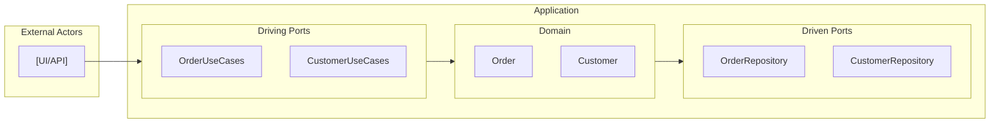

# Living Documentation

Generate architecture documentation automatically from your domain model. This tutorial covers the Living Documentation plugin and how to integrate it into your workflow.

## What Gets Generated

The Living Documentation plugin generates a complete documentation site:

| File | Description |
|------|-------------|
| `README.md` | Architecture overview with metrics and diagrams |
| `domain.md` | Domain model documentation (aggregates, entities, value objects) |
| `ports.md` | Ports documentation (driving and driven) |
| `diagrams.md` | Mermaid diagrams (class diagrams, flow diagrams) |

## Setup

### 1. Add the Living Doc Plugin

```xml
<plugin>
    <groupId>io.hexaglue</groupId>
    <artifactId>hexaglue-maven-plugin</artifactId>
    <version>${hexaglue.version}</version>
    <extensions>true</extensions>
    <configuration>
        <basePackage>com.example</basePackage>
    </configuration>
    <dependencies>
        <dependency>
            <groupId>io.hexaglue.plugins</groupId>
            <artifactId>hexaglue-plugin-living-doc</artifactId>
            <version>${hexaglue.version}</version>
        </dependency>
    </dependencies>
</plugin>
```

### 2. Generate Documentation

```bash
mvn compile
```

Documentation appears in `target/hexaglue/living-doc/`.

## Generated Documentation

### Architecture Overview (README.md)

The overview includes:

- **Summary metrics** - Aggregate roots, entities, value objects, ports counts
- **Navigation links** - Quick access to detailed documentation
- **Architecture diagram** - Mermaid flowchart showing hexagonal layers
- **Domain summary** - Table of aggregates and value objects
- **Ports summary** - Tables of driving and driven ports

Example output:

```markdown
# Architecture Overview

## Summary

| Metric | Count |
|--------|-------|
| Aggregate Roots | 2 |
| Entities | 3 |
| Value Objects | 5 |
| Driving Ports | 2 |
| Driven Ports | 2 |

## Architecture Diagram



### Domain Model Documentation (domain.md)

Complete documentation for each domain type:

- **Aggregate Roots** - With identity, properties, and relationships
- **Entities** - With their parent aggregate context
- **Value Objects** - Including records and enums
- **Identifiers** - Type-safe ID wrappers
- **Domain Events** - Event types with their properties
- **Domain Services** - Stateless domain logic
- **Application Services** - Use case orchestrators

Each type includes:
- Classification (AGGREGATE_ROOT, ENTITY, VALUE_OBJECT, etc.)
- Package location
- Properties with types
- Relationships to other domain types

### Ports Documentation (ports.md)

Complete documentation for ports:

- **Driving Ports** - Inbound interfaces (use cases)
- **Driven Ports** - Outbound interfaces (repositories, gateways)

Each port includes:
- Direction (DRIVING/DRIVEN)
- Kind (USE_CASE, REPOSITORY, etc.)
- Method signatures
- Related domain types

### Architecture Diagrams (diagrams.md)

Mermaid diagrams for visualization:

1. **Domain Model Class Diagram** - All domain types with relationships
2. **Aggregate Diagrams** - Each aggregate with its entities and value objects
3. **Ports Flow Diagram** - Interaction flow through hexagonal layers
4. **Dependencies Diagram** - Code dependencies pointing toward domain

## Configuration Options

Configure via `hexaglue.yaml`:

```yaml
plugins:
  io.hexaglue.plugin.livingdoc:
    outputDir: "living-doc"      # Default
    generateDiagrams: true       # Default
```

### Options

| Option | Default | Description |
|--------|---------|-------------|
| `outputDir` | `living-doc` | Output directory relative to `target/hexaglue/` |
| `generateDiagrams` | `true` | Generate Mermaid diagrams in diagrams.md |

### Disable Diagrams

If you don't need Mermaid diagrams:

```yaml
plugins:
  io.hexaglue.plugin.livingdoc:
    generateDiagrams: false
```

## Viewing the Documentation

### Local Preview

Open the generated Markdown files in any Markdown viewer:

```bash
# macOS
open target/hexaglue/living-doc/README.md

# Or use a Markdown preview tool
npx markserv target/hexaglue/living-doc/
```

### GitHub/GitLab

Copy generated docs to your repository:

```bash
cp -r target/hexaglue/living-doc/ docs/architecture/
git add docs/architecture/
git commit -m "docs: update architecture documentation"
```

Mermaid diagrams render automatically on GitHub and GitLab.

### Documentation Sites

Integrate with documentation generators:

**MkDocs**:
```yaml
# mkdocs.yml
nav:
  - Architecture:
    - Overview: architecture/README.md
    - Domain Model: architecture/domain.md
    - Ports: architecture/ports.md
    - Diagrams: architecture/diagrams.md
```

**Docusaurus**:
```
docs/
  architecture/
    _category_.json
    README.md
    domain.md
    ports.md
    diagrams.md
```

## Combining with Other Plugins

Living Documentation works alongside other plugins:

```xml
<plugin>
    <groupId>io.hexaglue</groupId>
    <artifactId>hexaglue-maven-plugin</artifactId>
    <version>${hexaglue.version}</version>
    <extensions>true</extensions>
    <configuration>
        <basePackage>com.example</basePackage>
    </configuration>
    <dependencies>
        <!-- Generate JPA code -->
        <dependency>
            <groupId>io.hexaglue.plugins</groupId>
            <artifactId>hexaglue-plugin-jpa</artifactId>
            <version>${hexaglue.version}</version>
        </dependency>
        <!-- Generate documentation -->
        <dependency>
            <groupId>io.hexaglue.plugins</groupId>
            <artifactId>hexaglue-plugin-living-doc</artifactId>
            <version>${hexaglue.version}</version>
        </dependency>
    </dependencies>
</plugin>
```

## CI/CD Integration

### Generate on Build

Documentation is generated automatically with `mvn compile`. Add a step to publish it:

**GitHub Actions**:
```yaml
- name: Generate and publish docs
  run: |
    mvn compile
    cp -r target/hexaglue/living-doc/ docs/architecture/

- name: Commit updated docs
  uses: stefanzweifel/git-auto-commit-action@v4
  with:
    commit_message: "docs: update architecture documentation"
    file_pattern: docs/architecture/*
```

**GitLab CI**:
```yaml
generate-docs:
  stage: build
  script:
    - mvn compile
    - cp -r target/hexaglue/living-doc/ public/
  artifacts:
    paths:
      - public/
```

## Best Practices

1. **Regenerate on changes** - Run `mvn compile` after domain model changes
2. **Commit generated docs** - Version control your architecture documentation
3. **Review in PRs** - Include doc changes in code reviews
4. **Link from README** - Reference architecture docs from your main README

## What's Next?

- [Architecture Audit](ARCHITECTURE_AUDIT.md) - Validate DDD/Hexagonal rules
- [Configuration](CONFIGURATION.md) - All plugin configuration options
- [Classification](CLASSIFICATION.md) - Understand domain type classification

**Example:** See [tutorial-living-doc](../examples/tutorial-living-doc/) for a complete Living Documentation example.
