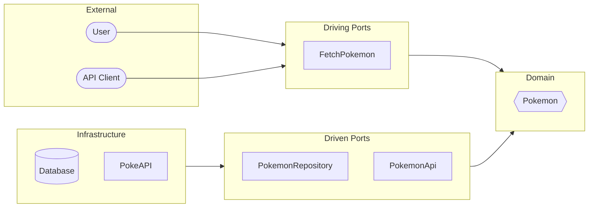

# My Hexagonal Pokedex

Pokemon API integration.

> Source: [github.com/theodo-fintech](https://github.com/theodo-fintech/my-hexagonal-pokedex)

## Hexagonal Architecture



## Domain

```
Pokemon ─── PokemonId
```

- **Pokemon**: Aggregate Root
- **PokemonId**: Identifier

## Ports

| Port | Kind | Role |
|------|------|------|
| `FetchPokemon` | API | Fetch pokemon by ID |
| `PokemonRepository` | SPI | Persistence |
| `PokemonApi` | SPI | External API (PokeAPI) |

## Run

```bash
mvn clean compile
mvn spring-boot:run
```
