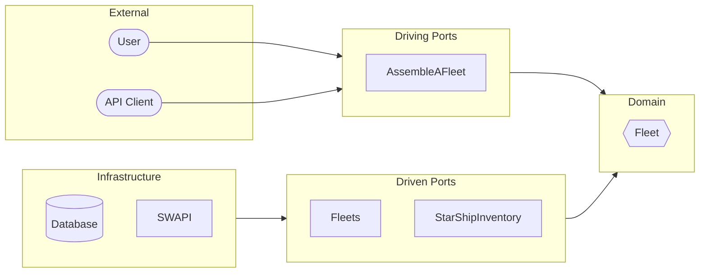

# Hexagonal Architecture Java Springboot

External API integration (SWAPI).

> Source: [gitlab.com/beyondxscratch](https://gitlab.com/beyondxscratch/hexagonal-architecture-java-springboot)

## Hexagonal Architecture



## Domain

```
Fleet ─┬─ FleetId
       └─ StarShip (collection)
```

- **Fleet**: Aggregate Root
- **StarShip**: Value Object (name, manufacturer)

## Ports

| Port | Kind | Role |
|------|------|------|
| `AssembleAFleet` | API | Assemble fleet from starships |
| `Fleets` | SPI | Persistence |
| `StarShipInventory` | SPI | External API (SWAPI) |

## Run

```bash
mvn clean compile
mvn spring-boot:run
```

## Generated

```
target/generated-sources/hexaglue/
├── FleetEntity.java
├── StarShipEmbeddable.java
├── FleetJpaRepository.java
├── FleetMapper.java
├── StarShipMapper.java
└── FleetAdapter.java
```
